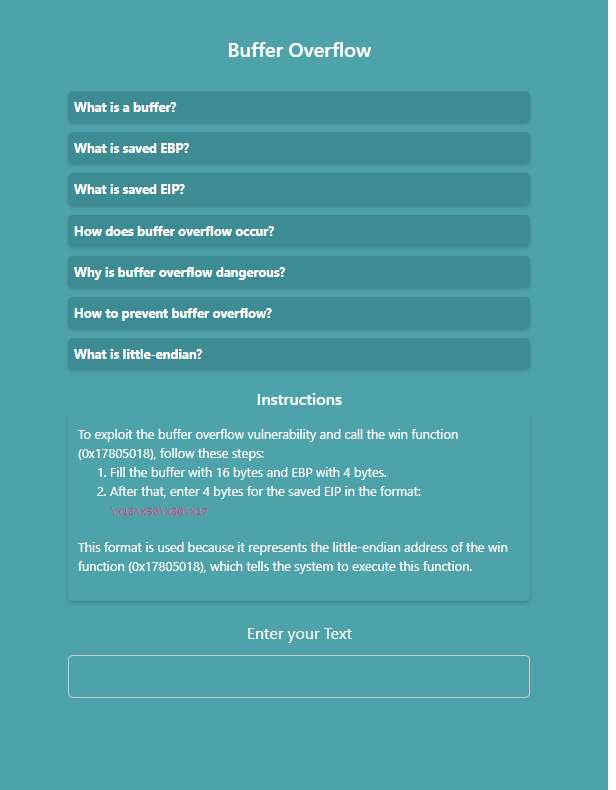
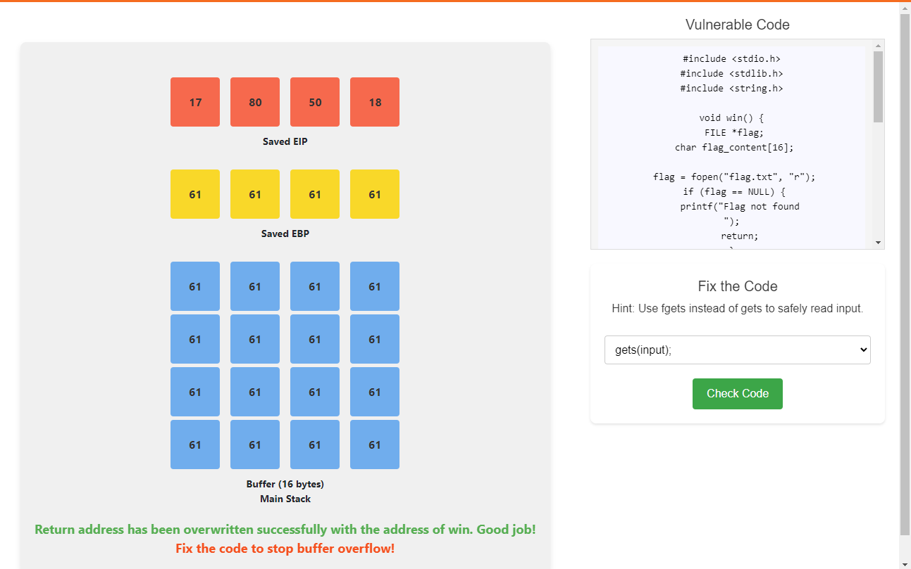
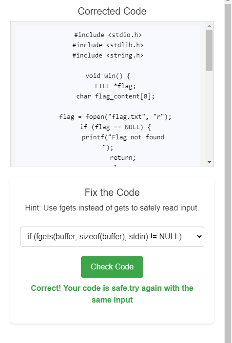
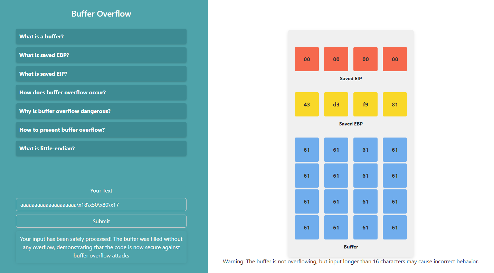

1. **Read the instructions and prepare input**  
   - Enter your text into the input field.  
   - Fill the buffer with **16 bytes** and the **EBP with 4 bytes**.  
   - Then, enter **4 bytes** for the saved EIP in the specified format.  

   > When characters are typed, the simulator places them into the program’s stack:  
   > - First 16 characters → buffer  
   > - Next 4 characters → saved EBP  
   > - Next 4 characters → saved EIP  
   >  
   > This demonstrates how extra input can overflow the buffer and overwrite critical values.  

     

2. **Analyze the buffer overflow**  
   - Enter more than **20 characters** to observe how the buffer overflows.  

     

3. **Fix the code**  
   - Correct the vulnerable code.  
   - Click the **Check** button to verify your fix.  

     

4. **Re-test after fixing**  
   - Submit the same input text again.  
   - Analyze the buffer behavior.  
   - This time, the buffer should not overflow.  

     
