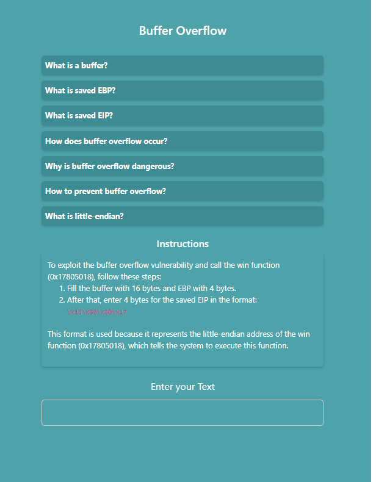
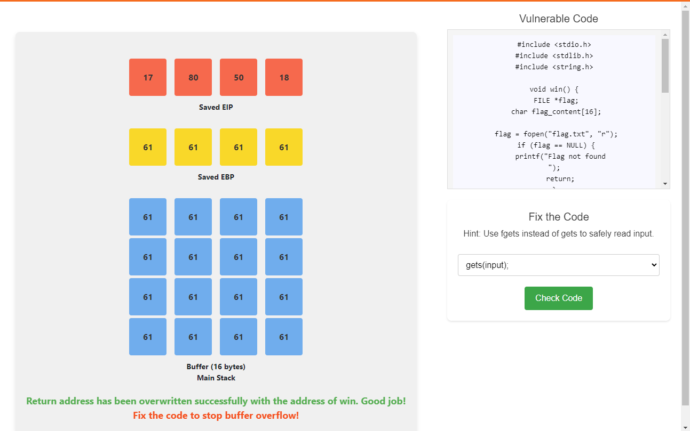
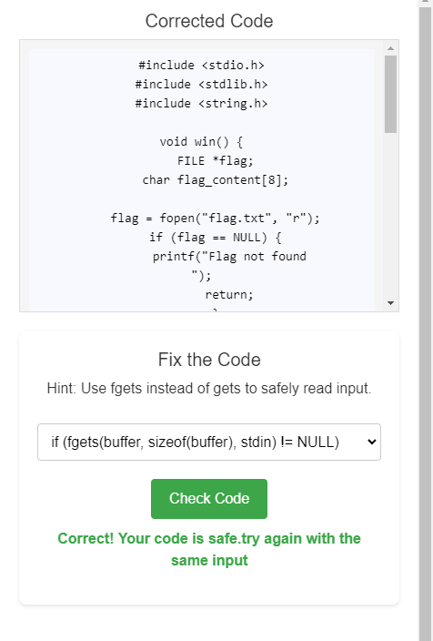
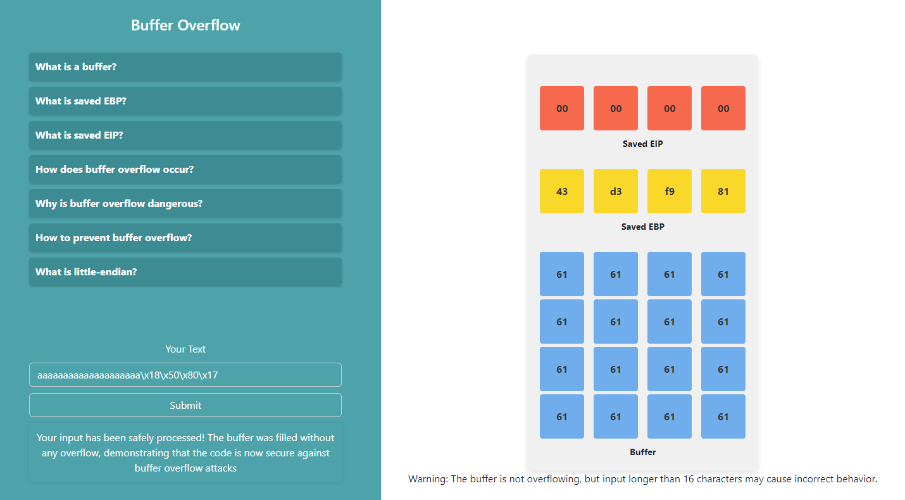

### Procedure

1. Read the instructions and enter your text. Fill the buffer with 16 bytes and EBP with 4 bytes. After that, enter 4 bytes for the saved EIP in the specified format.

2. Analyze the buffer overflow as you enter more than 20 characters.

3. Fix the code and click the check button to verify the code.

4. After fixing the code, submit the same text again and analyze the buffer. This time, it should not overflow.

